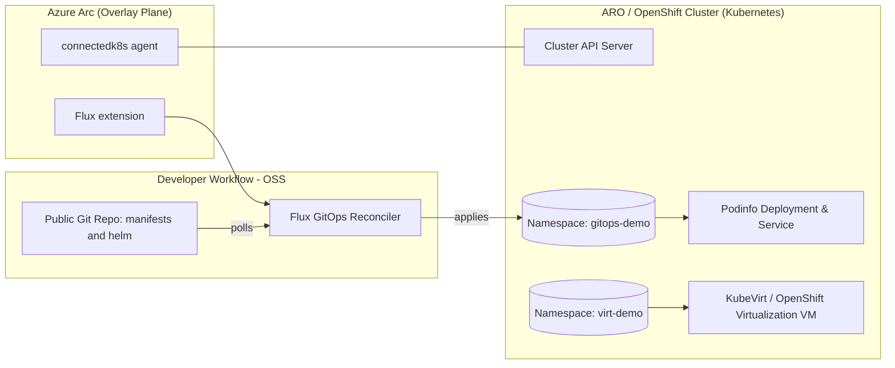

# **From “Open” to “Operable”: ARO Virtualization + Arc-enabled Hybrid, with OSS-First Workflows**

**Synopsis (2 sentences):**  
This session shows how OpenShift on Azure (ARO) can run open-source-native workflows—GitOps, KubeVirt-based virtualization, and eBPF-friendly tooling—while staying portable across clouds and datacenters via Azure Arc. We’ll deploy a tiny, reproducible demo live: onboard an OpenShift cluster to Arc, bootstrap a GitOps app from a public repo, and spin up a Fedora VM with OpenShift Virtualization in under 10 minutes.

---

## Why this matters to open-source devs (you can say this up front)

- **OSS-first**: K8s, KubeVirt (OpenShift Virtualization), Flux (GitOps), containerd/CRI-O, and standard `kubectl/oc/helm` tooling.  
- **Optionality**: Nothing here “locks you in”—Arc is an overlay plane; GitOps sources can live on any public Git forge; KubeVirt manifests are just CRDs.  
- **Security posture, your way**: Keep using your OSS scanners, SBOMs, and policy engines; Arc/Defender and Azure Policy add posture management if you want them—without changing your app contracts.  

---

## 15-Minute Talk Track (minute-by-minute)

**0:00 – 1:00 | Title & hook**  
- “From ‘Open’ to ‘Operable’—let’s prove hybrid can be boringly automatable.”  
- Promise: 3 artifacts, all OSS-centric: Flux GitOps app, KubeVirt VM, Arc overlay.

**1:00 – 3:00 | OSS credibility & ground rules**  
- ARO = upstream K8s distribution with Red Hat OpenShift; OpenShift Virtualization = KubeVirt.  
- Tooling we’ll use: `oc`, `kubectl`, `az`, Flux GitOps (no walled gardens).  
- Where this runs: Your laptop, on-prem OpenShift/OKD, or ARO—the manifests are portable.

**3:00 – 5:00 | Architecture overview (walk the diagram below)**  
- Layers: Cluster (OpenShift), Overlay (Arc), Delivery (Flux GitOps), Workloads (podinfo), VM (KubeVirt Fedora).  
- The key idea: Git is source of truth; cloud is just another consumer of state.

**5:00 – 9:00 | Live demo part 1: Arc + GitOps app**  
- Connect OpenShift to Azure Arc (overlay plane only).  
- Install Flux extension; point it to a public Git repo; watch Podinfo roll out.  
- Call out: no fork required; change a value in Git → reconcile to cluster.

**9:00 – 12:00 | Live demo part 2: OpenShift Virtualization (KubeVirt)**  
- Apply a `VirtualMachine` CR with a Fedora container disk + cloud-init to start nginx.  
- Show the VM starting (`Running: true`), and curl the service endpoint.  
- Emphasize “VMs as YAML”—infra and app consistent with GitOps.

**12:00 – 14:00 | Production pivots (what you’d do next)**  
- Policy: Gate deployments with Policy/OPA/Kyverno; use SBOMs; set admission controls.  
- Observability: Prometheus/Grafana/Alertmanager; optional Arc insights; keep your eBPF stack.  
- Security add-ons: Optional Defender posture (agent/agentless), image scanning choices remain yours.

**14:00 – 15:00 | Close**  
- Links back to the principles: open interfaces, portable manifests, boring automation.  
- CTA: “Clone the file I’m using; run the script; break it in your lab and make it better.”

---

## High-Level Architecture



---

## Demo Timeline (Sequence)

```mermaid
sequenceDiagram
  participant You
  participant oc as oc/kubectl
  participant az as az (Arc)
  participant flux as Flux
  participant kvirt as KubeVirt

  You->>az: az connectedk8s connect (OpenShift to Arc)
  az-->>You: Cluster onboarded to Arc
  You->>az: az k8s-extension create (Flux)
  az-->>flux: Flux controllers installed
  You->>flux: Configure Git source and Kustomization
  flux-->>oc: Apply Podinfo manifests
  oc-->>You: Deployment/Service ready

  You->>oc: oc apply -f virtualmachine.yaml
  oc-->>kvirt: Create VM (Fedora containerDisk + cloud-init)
  kvirt-->>oc: VM running; Service reachable
  oc-->>You: curl to service returns 200 OK (nginx)
```

---

## Prereqs (explicit & honest)

- You have an ARO cluster with **cluster-admin** and **OpenShift Virtualization** already installed/enabled.  
- `oc`, `kubectl`, and `az` CLIs are installed; you can `oc login` to the cluster and `az login` to your Azure subscription.  
- Network egress from the cluster to `github.com` (for Flux pulling a public repo).  
- An Azure resource group and region ready for Arc resources.

> Tip: If you don’t have OpenShift Virtualization enabled yet, do that beforehand via OperatorHub (“OpenShift Virtualization”) and ensure the `HyperConverged` CR reports Available.

---

## One-Shot Demo Script (Arc + Flux GitOps app + KubeVirt VM)

> Save as `demo.sh`, `chmod +x demo.sh`, then run: `./demo.sh`.  
> Re-run friendly and idempotent where possible. Includes a `cleanup.sh` at the end.

```bash
#!/usr/bin/env bash
set -euo pipefail

# ------------------------------
# Config (edit these)
# ------------------------------
RESOURCE_GROUP="${RESOURCE_GROUP:-aro-demo-rg}"
LOCATION="${LOCATION:-eastus}"
ARC_CLUSTER_NAME="${ARC_CLUSTER_NAME:-aro-open-demo}"
SUBSCRIPTION_ID="${SUBSCRIPTION_ID:-$(az account show --query id -o tsv 2>/dev/null || echo "")}"

# GitOps app (public OSS)
GIT_REPO_URL="${GIT_REPO_URL:-https://github.com/stefanprodan/podinfo}"
GIT_BRANCH="${GIT_BRANCH:-master}"

# Namespaces
NS_GITOPS="gitops-demo"
NS_VIRT="virt-demo"

# ------------------------------
# Pre-flight checks
# ------------------------------
echo "🔎 Checking CLI availability..."
command -v az >/dev/null || { echo "az not found"; exit 1; }
command -v oc >/dev/null || { echo "oc not found"; exit 1; }
command -v kubectl >/dev/null || { echo "kubectl not found"; exit 1; }

echo "🔐 Verifying Azure login..."
az account show >/dev/null || az login >/dev/null

if [[ -z "$SUBSCRIPTION_ID" ]]; then
  SUBSCRIPTION_ID="$(az account show --query id -o tsv)"
fi
az account set --subscription "$SUBSCRIPTION_ID"

echo "🧪 Verifying oc login (current project):"
oc project >/dev/null

# ------------------------------
# Azure resource group (idempotent)
# ------------------------------
echo "🧱 Ensuring resource group: $RESOURCE_GROUP in $LOCATION"
az group create -n "$RESOURCE_GROUP" -l "$LOCATION" >/dev/null

# ------------------------------
# Connect OpenShift cluster to Azure Arc (idempotent)
# ------------------------------
echo "🔗 Onboarding cluster to Azure Arc (connectedk8s)..."
if az connectedk8s show -g "$RESOURCE_GROUP" -n "$ARC_CLUSTER_NAME" >/dev/null 2>&1; then
  echo "ℹ️ Arc connection already exists: $ARC_CLUSTER_NAME"
else
  az connectedk8s connect \
    --name "$ARC_CLUSTER_NAME" \
    --resource-group "$RESOURCE_GROUP" \
    --distribution "openshift" \
    --location "$LOCATION"
fi

# ------------------------------
# Install Flux via Azure Arc extension (idempotent)
# ------------------------------
echo "🧩 Installing Flux GitOps extension via Arc..."
if az k8s-extension show --cluster-name "$ARC_CLUSTER_NAME" \
    --resource-group "$RESOURCE_GROUP" \
    --cluster-type connectedClusters \
    --name flux >/dev/null 2>&1; then
  echo "ℹ️ Flux extension already installed."
else
  az k8s-extension create \
    --name flux \
    --extension-type Microsoft.KubernetesConfiguration/flux \
    --cluster-type connectedClusters \
    --cluster-name "$ARC_CLUSTER_NAME" \
    --resource-group "$RESOURCE_GROUP"
fi

# ------------------------------
# Bootstrap Git source + Kustomization (namespace-scoped)
# ------------------------------
echo "📦 Creating namespace for GitOps app: $NS_GITOPS"
oc new-project "$NS_GITOPS" >/dev/null 2>&1 || true

# Define Flux GitRepository & Kustomization via Kubernetes manifests
WORKDIR="$(mktemp -d)"
cat > "$WORKDIR/git-source.yaml" <<EOF
apiVersion: source.toolkit.fluxcd.io/v1
kind: GitRepository
metadata:
  name: podinfo-source
  namespace: $NS_GITOPS
spec:
  interval: 1m
  url: $GIT_REPO_URL
  ref:
    branch: $GIT_BRANCH
EOF

cat > "$WORKDIR/kustomization.yaml" <<EOF
apiVersion: kustomize.toolkit.fluxcd.io/v1
kind: Kustomization
metadata:
  name: podinfo-kustomize
  namespace: $NS_GITOPS
spec:
  interval: 1m
  targetNamespace: $NS_GITOPS
  sourceRef:
    kind: GitRepository
    name: podinfo-source
  path: "./kustomize"
  prune: true
  wait: true
EOF

echo "🚀 Applying Flux objects..."
kubectl apply -f "$WORKDIR/git-source.yaml"
kubectl apply -f "$WORKDIR/kustomization.yaml"

echo "⏳ Waiting for Podinfo rollout (up to ~2 minutes)..."
kubectl -n "$NS_GITOPS" wait --for=condition=available --timeout=180s deploy -l app.kubernetes.io/name=podinfo || true

echo "🔎 Services in $NS_GITOPS:"
kubectl -n "$NS_GITOPS" get svc

# ------------------------------
# OpenShift Virtualization: Fedora VM with nginx via cloud-init
# ------------------------------
echo "🧰 Creating virtualization namespace: $NS_VIRT"
oc new-project "$NS_VIRT" >/dev/null 2>&1 || true

cat > "$WORKDIR/virtualmachine.yaml" <<'EOF'
apiVersion: kubevirt.io/v1
kind: VirtualMachine
metadata:
  name: fedora-nginx
  labels:
    app: fedora-nginx
spec:
  running: true
  template:
    metadata:
      labels:
        kubevirt.io/domain: fedora-nginx
        app: fedora-nginx
    spec:
      domain:
        cpu:
          cores: 2
        resources:
          requests:
            memory: 2Gi
        devices:
          disks:
            - name: containerdisk
              disk:
                bus: virtio
            - name: cloudinitdisk
              disk:
                bus: virtio
      networks:
        - name: podnet
          pod: {}
      volumes:
        - name: containerdisk
          containerDisk:
            image: quay.io/containerdisks/fedora:39
        - name: cloudinitdisk
          cloudInitNoCloud:
            userData: |
              #cloud-config
              password: fedora
              chpasswd: { expire: False }
              packages:
                - nginx
              runcmd:
                - [ sh, -c, "systemctl enable --now nginx" ]
                - [ sh, -c, "echo 'hello from kubevirt on openshift' > /usr/share/nginx/html/index.html" ]
EOF

# Optional service (ClusterIP) to reach nginx from within the cluster
cat > "$WORKDIR/svc.yaml" <<EOF
apiVersion: v1
kind: Service
metadata:
  name: fedora-nginx-svc
  namespace: $NS_VIRT
spec:
  selector:
    app: fedora-nginx
  ports:
    - name: http
      port: 80
      targetPort: 80
      protocol: TCP
  type: ClusterIP
EOF

echo "🖥️  Creating VM and service..."
kubectl -n "$NS_VIRT" apply -f "$WORKDIR/virtualmachine.yaml"
kubectl -n "$NS_VIRT" apply -f "$WORKDIR/svc.yaml"

echo "⏳ Waiting for VM to be Running..."
# Wait until the corresponding VMI is running
for i in {1..30}; do
  PHASE="$(kubectl -n "$NS_VIRT" get vmi fedora-nginx -o jsonpath='{.status.phase}' 2>/dev/null || echo "Pending")"
  [[ "$PHASE" == "Running" ]] && break
  sleep 5
done
kubectl -n "$NS_VIRT" get vmi

echo "🔎 Pod backing the VM and its IP (for quick curl inside cluster):"
kubectl -n "$NS_VIRT" get pod -l kubevirt.io/domain=fedora-nginx -o wide || true
kubectl -n "$NS_VIRT" get svc fedora-nginx-svc -o wide || true

cat > cleanup.sh <<'CLEAN'
#!/usr/bin/env bash
set -e
echo "🧹 Cleaning up demo resources..."
NS_GITOPS="gitops-demo"
NS_VIRT="virt-demo"

kubectl -n "$NS_VIRT" delete -f "$WORKDIR/svc.yaml" --ignore-not-found || true
kubectl -n "$NS_VIRT" delete -f "$WORKDIR/virtualmachine.yaml" --ignore-not-found || true
oc delete project "$NS_VIRT" --ignore-not-found || true

kubectl -n "$NS_GITOPS" delete kustomization.kustomize.toolkit.fluxcd.io/podinfo-kustomize --ignore-not-found || true
kubectl -n "$NS_GITOPS" delete gitrepository.source.toolkit.fluxcd.io/podinfo-source --ignore-not-found || true
oc delete project "$NS_GITOPS" --ignore-not-found || true

# Uncomment to remove Arc connection:
# az connectedk8s delete -g "$RESOURCE_GROUP" -n "$ARC_CLUSTER_NAME" -y || true

echo "✅ Cleanup complete."
CLEAN
chmod +x cleanup.sh

echo ""
echo "✅ Demo setup complete."
echo "   - GitOps app namespace: $NS_GITOPS (Podinfo)"
echo "   - VM namespace: $NS_VIRT (Fedora VM with nginx)"
echo "   - Cleanup: ./cleanup.sh"
echo ""
echo "👉 Next: Inside the cluster, try: kubectl -n $NS_VIRT run curl --image=curlimages/curl --rm -it -- sh -c 'curl -s http://fedora-nginx-svc.$NS_VIRT.svc.cluster.local/'"
```

---

## What to *say while it runs* (color commentary)

- **On Arc connect:** “This doesn’t mutate Kubernetes primitives—it registers the cluster so Azure can *observe and automate*. Remove it and the cluster keeps working.”  
- **On Flux:** “No secret sauce. These are standard Flux CRDs that reconcile from a public Git repo.”  
- **On KubeVirt VM:** “VMs as YAML means the same GitOps workflow can place VMs *next to* your pods. If you’re modernizing, this bridges the gap without a forklift.”

---

## Optional Hardening / Next Steps (bullets you can mention)

- Gate images with your existing OSS scanners (Trivy, Grype) and/or Azure Policy.  
- Layer on Prometheus/Grafana/Alertmanager (self-managed) or Arc-enabled monitoring.  
- If you enable Defender for Containers, you can do it cluster-wide or selectively; you still keep SBOM and SLSA pipelines you already use.  
- For multi-cluster, point multiple clusters (on-prem OKD, edge K3s, ARO) at the *same* Git source with environment overlays.

---

## Cleanup

```bash
./cleanup.sh
```

---

### Notes & Disclaimers (be transparent)

- The script assumes OpenShift Virtualization (KubeVirt) is **already** installed and healthy. In many orgs that’s a one-time platform step.  
- The GitOps sample uses a public repo to avoid credentials in a live demo; for production, pin SHAs and use deploy keys.  
- If your cluster blocks outbound to GitHub, mirror the repo or vend artifacts through your internal registry.

---

**That’s it—15 minutes of “open by default, operable on day one.”**
